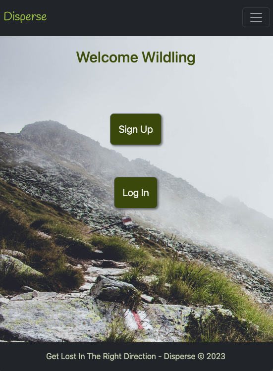
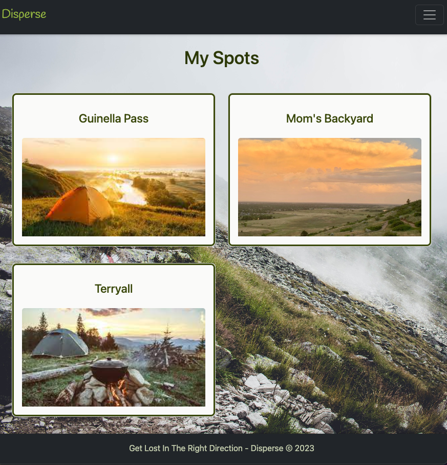
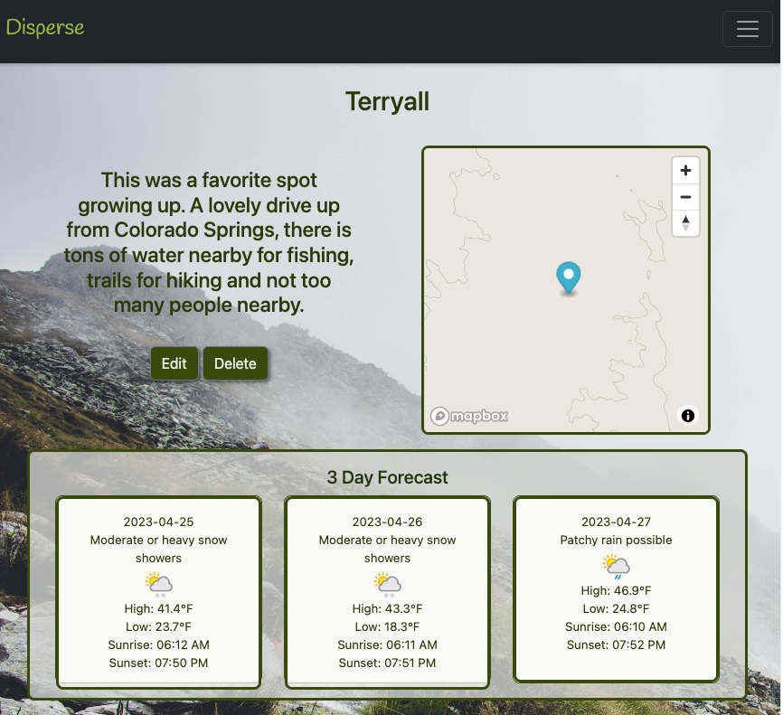
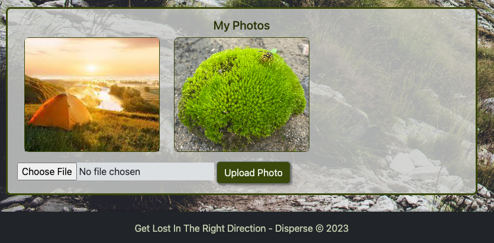

# Disperse
A full-stack Django App for Wilderness lovers and adventurers. User's can login with Django's built-in authentication to keep track of their favorite camping sites. Disperse features a "find my location" option that aides in displaying a map of the area. Other features include local weather data fetched from WeatherAPI and photo upload capabilities. 

## Technologies Used
- Django
- Python
- JavaScript
- PostreSQL
- CSS
- HTML
- Bootstrap
- WeatherAPI
- Mapbox & Folium

## Preview
Home Page

## Getting started
[Click Here](https://disperse.herokuapp.com/) to see the deployed app!

## Coming soon
### Map features such as:
- Layers for trail conditions
- Current fire restrictions
- Distances to water stations/showers, etc.
